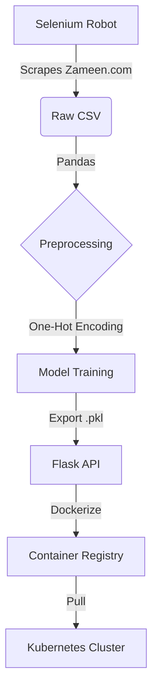

# RentSphere Intelligence Engine


An End-to-End MLOps pipeline that scrapes real-estate data, trains a price prediction model, and serves predictions via a scalable API. Designed for high-availability using Kubernetes.

## Architecture
1.  **Data Pipeline:** Selenium scraper harvesting real-time rental listings (Zameen.com).
2.  **Preprocessing:** Pandas pipeline for currency conversion (Crore/Lakh to Integer) and Unit Standardization (Marla/Kanal).
3.  **Model:** Linear Regression model serialized with Joblib.
4.  **Deployment:** Flask API containerized with Docker and orchestrated via Kubernetes.
   

## 🏗️ Architecture Breakdown

   



## Quick Start

### 1. Run with Docker (Recommended)
The fastest way to test the prediction engine.

```bash
# Pull the image from Docker Hub
docker pull shersaad/rent-price-predictor:v1

# Run the container (Map port 5000)
docker run -p 5000:5000 shersaad/rent-price-predictor:v1
```
